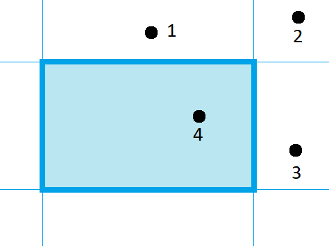
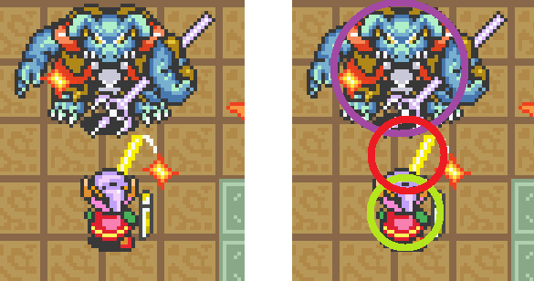
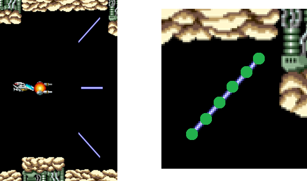
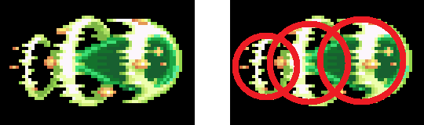

# Basic Collision Detection in Games

With the exception of a few types of games that deal with abstract concepts, such as cards or board games, most games generally replicate some sort of physical objects. Whether this is a person running around in a room, or bullets flying through space, being able to detect whether two objects are colliding is a recurring problem. 

In this tutorial I'll go over a few of the common types of situations that you may encounter, and offer a typical solution for basic collision detection. 

This tutorial is separated into a few sections. Feel free to skip around.

### Part 1: Basic geometric intersections

* [Checking if a point is in a rectangle](#point-in-a-rectangle)
* [Checking if a point is in a circle](#point-in-a-circle)
* [Checking if two rectangles overlap](#intersection-of-two-rectangles)
* [Checking if two circles overlap](#intersection-of-two-circles)
* [Checking if a circle and a rectangle overlap](#rectangle-and-a-circle-intersection)

### Part 2: Groups of sprites

* [Checking if one specific sprite touches any sprite in another group](#scenario-1-one-player-and-multiple-enemies)
* [Checking if any sprite in one group touches any sprite in another group when the groups are small](#scenario-2-check-collisions-between-two-different-sets)
* [Checking if any sprite in one group touches any sprite in another group when the groups are really big](#scenario-2b-but-theres-hundreds-of-them)
* [Using grid logic](#player-vs-walls-and-obstacles)

### Part 3: Miscellaneous situations

* [A character swinging a weapon](#player-swinging-a-weapon)
* [Collisions with weird shaped objects](#weird-shaped-objects)

## Definition of a Sprite

Before we start, I'll define the term **sprite**. A sprite is not really a specific technical term, but rather the abstract idea of a physical object being represented in your program in some way. The way to represent a sprite can be done in a variety of ways. Usually they're a list of objects that have some sort of size and location. Other times, a sprite can simply be a single coordinate. The way a sprite is represented doesn't really matter and the term sprite merely refers to the fact that it resembles an object in the physical world.

Regardless of how a sprite is represented, it generally has a location, size, and shape of some sort. Consider a character that is drawn to the screen as an image. The sprite's location may be the location of the image, the size and shape is that of the rectangular image itself. It's very common for sprites to be shaped like a rectangle, but not always. Sometimes, if the picture of the sprite is not very rectangular, sometimes it is more effective to represent the character's field of collision as a circle. In the case of a bullet, sometimes the sprite is represented as a single point since it's so small. I'll quickly go over the math of how to tell if these shapes overlap.

If you're more interested in the algorithm aspects of collision detection of many sprites rather than the math behind specific kinds of geometric collisions, feel free to skip this section.

## Point in a rectangle

To see if a point is inside a rectangle, simply check each side to see if it's on the inner side of each. If it's on the inside of each side, then it's inside the rectangle.

```csharp
function isPointRectangleCollision(point, rectangle) {
    return
        point.x > rectangle.left &&
        point.x < rectangle.right && 
        point.y > rectangle.top &&
        point.y < rectangle.bottom;
}
```

* Point 1 is in range of the x coordinates but not the y coordinates.
* Point 2 is neither in range of the x or y coordinates.
* Point 3 is in range of the y coordinates but not the x coordinates.
* Point 4 is in range of all 4.



## Point in a circle

To see if a point is in a circle, check the distance between the point and the center of the circle. If the distance is less than the radius, then it's inside. The distance formula is squareRoot(xDifference<sup>2</sup> + yDifference<sup>2</sup>). However, it's faster for a computer to square a number than it is to find the square root. Since we're checking if the distance is less than the radius, it is faster to check to see if the square of the distance is less than the square of the radius. You'll see this pattern of avoiding square root in favor of squaring throughout this tutorial.

TODO: add image

```csharp
function isPointCircleCollision(point, circle) {
    dx = point.x - circle.centerX;
    dy = point.y - circle.centerY;
    return dx ** 2 + dy ** 2 < circle.radius ** 2;
}
```

## Intersection of Two Rectangles

This is a little more complicated. It is essentially just a list of all the possible situations where two rectangles are not overlapping. If the right side of one rectangle is completely to the left of the left side of another rectangle, then they cannot overlap. Using that logic for all 4 sides is sufficient to determine that two rectangles do not overlap.

TODO: add image

```csharp
function isRectangleCollision(rect1, rect2) {
    if (rect1.right < rect2.left) return false;
    if (rect1.left > rect2.right) return false;
    if (rect1.bottom < rect2.top) return false;
    if (rect1.top > rect2.bottom) return false;
    return true;
}
```

## Intersection of Two Circles

Like checking if a point is in a circle, you use the distance formula, except this time, it's the distance between the two centers of the circles. Instead of checking if that distance is less than the radius, you check to see if that distance is less than their combined radii. Notice that squaring the sum of the radii is used instead of using the square root function on the other side of the final inequality.

TODO: add image

```csharp
function isCircleCollision(circle1, circle2) {
    dx = circle1.centerX - circle2.centerX;
    dy = circle1.centerY - circle2.centerY;
    return dx ** 2 + dy ** 2 < (circle1.radius + circle2.radius) ** 2;
}
```

## Rectangle and a Circle Intersection

This is the most complicated combination of intersection logic for these 3 shapes. 

There are 3 possible situations: 

* A circle's right-most point can be entirely located to the left of the left side of the rectangle. Similarly the left-most point can be located to the right of the right side of the rectangle. And the same logic can be applied to the other Y directions. If any of these are true, then it is impossible for the circle to overlap the rectangle. This is similar to the rectangle intersection logic.
* If the above situation isn't true and a circle's center is to the left of the left side of a rectangle and it's also above the top of the rectangle, then it's possible that it doesn't overlap. In this situation check to see if the corner is in the circle. If it isn't, then it doesn't overlap. If it is, then it does overlap.
* If it isn't one of the above situations, then that means they intersect.

TODO: add image

```csharp
function isRectangleCircleCollision(rectangle, circle) {
    if (circle.centerX + circle.radius < rectangle.left) return false;
    if (circle.centerX - circle.radius > rectangle.right) return false;
    if (circle.centerY + circle.radius < rectangle.top) return false;
    if (circle.centerY - circle.radius > rectangle.bottom) return false;

    dx = null;
    dy = null;
    if (circle.centerX < rectangle.left) {
        if (circle.centerY < rectangle.top) {
            dx = circle.centerX - rectangle.left;
            dy = circle.centerY - rectangle.top;
        } else if (circle.centerY > rectangle.bottom) {
            dx = circle.centerX - rectangle.left;
            dy = circle.centerY - rectangle.bottom;
        }
    } else if (circle.centerX > rectangle.right) {
        if (circle.centerY < rectangle.top) {
            dx = circle.centerX - rectangle.right;
            dy = circle.centerY - rectangle.top;
        } else if (circle.centerY > rectangle.bottom) {
            dx = circle.centerX - rectangle.right;
            dy = circle.centerY - rectangle.bottom;
        }
    }

    if (dx != null) {
        return dx ** 2 + dy ** 2 < circle.radius ** 2
    }

    return true;
}
```

Now that your panic flashback to high school geometry is over, let's get to the fun part. Sprites!

I will assume that all sprites are rectangular in the code sample. This is to illustrate the process of iterating through sprites. Since you now have the math to do any sort of intersection, you would naturally swap out the collision pattern with the appropriate one.

## Scenario 1: One player and multiple enemies
Or in other words, "does 1 specific sprite collide with any other sprites in a set?"

TODO: add image

This is the most straightforward situation where you have one specific sprite you're tracking that you would like to check against another set of sprites. This is simply a single loop checking each enemy to see if it collides with the player. If one is found, this function returns true. If none are found, then it returns false.

```csharp
function isCollision(player, enemies) {
    for (enemy : enemies) {
        if (isRectCollision(enemy.bounds, player.bounds)) {
            return true;
        }
    }
    return false;
}
```

## Scenario 2: Check collisions between two different sets

Or in other words "many bullets and many enemies".

TODO: add image

This is a little more complicated. If you know that the number of enemies and bullets will be limited, it may be appropriate to simply use a nested for loop, checking each possible pair of enemy + bullet to see if there's an intersection.

```csharp
function applyCollisions(bullets, enemies) {
    for (bullet : bullets) {
        for (enemy : enemies) {
            if (!enemy.alreadyHit()) {
                if (isPointRectCollision(bullet.location, enemy.bounds)) {
                    enemy.markAsHit();
                    bullet.markAsStopped();
                    break; // stop checking other enemies since this bullet has been blocked.
                }
            }
        }
    }
}
```

## Scenario 2B: But there's hundreds of them

If this is like a Megaman game where the number of bullets you're allowed to shoot is capped at a maximum of 3 and there's about a dozen enemy robots on the screen at most, then this simple code is good enough. But problems arise if this is a traditional "bullet hell" game where there are a hundred alien spaceships on the screen and about a hundred bullets. This means that the collision code runs about 10,000 times. In computer science, this is referred to as a O(n<sup>2</sup>) algorithm. (pronounced "Big O of n squared"). This is because as your data set increases, the time it takes your code to run increases quadratically.

TODO: add image

One way to get this to become a O(n) algorithm ("Big O of n" or simply "linear") is to implement a strategy called bucketing. 

Imagine, hypothetically, that this game is played on a field that's 1000 x 1000 pixels and the enemy spaceships are about 10 pixels wide. It seems silly to spend time checking if a spaceship in the bottom left corner of the screen is colliding with a bullet in the center of the screen.  

The following logic is somewhat complicated, but no longer quadratic in nature. This code starts by looping through all the bullets and assigning them into a bucket. This is a linear operation, because the time it takes scales linearly with the number of bullets.

TODO: add image of bucket grid

```csharp
function applyCollisions(bullets, enemies) {
    bulletsByBucket = {};
    for (bullet : bullets) {
        bucketX = bullet.x / 100;
        bucketY = bullet.y / 100;
        bucketId = bulletX * 100 + bulletY;
        bucket = bulletsByBucket.get(bucketId);
        if (bucket == null) {
            bulletsByBucket[bucketId] = [bullet];
        } else {
            bucket.add(bullet);
        }
    }

    neighborOffsets = [0, -1, 1, -100, -99, -101, 100, 99, 101];
    for (enemy : enemies) {
        enemyBucket = (enemy.centerX / 100) * 100 + (enemy.centerY / 100);
        collided = false;
        for (offset : neighborOffsets) {
            nearbyBullets = bulletsByBucket.get(enemyBucket + offset);
            if (nearbyBullets != null) {
                for (bullet : nearbyBullets) {
                    if (!bullet.alreadyCollided()) {
                        if (isPointRectCollision(bullet.location, enemy.bounds)) {
                            enemy.markAsHit();
                            bullet.markAsStopped();
                            collided = true;
                            break;
                        }
                    }
                }
            }
            if (collided) break;
        }
    }
}
```

Then it loops through the enemies list as is. For each enemy (where each one is relatively small), we check the bucket it is located in, along with the 8 nearby buckets. For the most part, these buckets will be non-existent, since most of the screen will be bullet-free (I assume). If there happens to be a bullet in that bucket (and there will most likely only be 0, 1, or maybe 2), then it checks only those bullets against the enemy's location. Since this will generally result in small number of bullets checked against each enemy (that will rarely exceed a couple and typically be 0) regardless of how many bullets are on the screen, this now behaves like a linear algorithm, which means the amount of time this takes will increase proportionally to the number of items on the screen. Not quadratically. 

Note that the bucket size cannot be much smaller than the sprites themselves. If the sprites were, for example, hundreds of pixels wide, then there would be a problem because you would need to check many buckets for bullets rather than 9. 

Strictly speaking this is still susceptible to certain edge cases where it will perform quadratically. If a thousand bullets and a thousand enemies all move to the same location on the screen, rather than performing thousands of collision checks, it will now perform a million and it will have the same problem as before. 

This is only one example of an optimization which is tailored for a specific kind of game. Optimizations frequently require creativity and caution. 

## Player vs walls and obstacles

With other sprites, you generally allow one sprite to move on top of another sprite, and some sort of event happens, such as the sprite disappearing, or a lose screen appearing. However, when checking a sprite against an obstacle, you don't want the sprite to move over it. For these, you generally calculate where a sprite is about to move, and perform the collision detection against the hypothetical coordinates. 

It is also very common for the environment to be represented in some other way other than simple sprite objects that have a rectangular or circular shape. For example, a wall can simply be the edge of the screen. In this case, you would check to see if the sprite moves over the edge, and prevent the movement if it does. 

But the world usually more complicated. It is very common for game worlds to be constructed on a grid, sometimes referred to as tiles. Usually these tiles are complicated objects that have some sort of image and other qualities, but for the sake of simplicity, let's assume our game only has a grid of booleans, where true represents a tile that the player can walk on, and false is one that is blocking and that our player is a single point. 

TODO: add image

```csharp
const TILE_WIDTH = 20;

function isMovementAllowed(newX, newY, grid) {
    columns = grid.length;
    rows = grid[0].length;
    if (newX < 0 || newY < 0) return false;
    if (newX >= columns || newY >= rows) return false;
    column = newX / TILE_WIDTH;
    row = newY / TILE_WIDTH;
    return grid[column][row];
}
```

As long as you keep the player in a place where they're allowed to move, there's no need to check anything other than new coordinates that the player wants to move to. Because a square tile has some sort of width and height, we divide the player's pixel coordinate by the tile width (and assuming these are all integers, doing so will yield an integer as well). As long as that column is in range, then you can use the grid to perform your collision logic.

## Miscellaneous Situations

### Player swinging a weapon

Suppose you have a zelda-like where, in some of the sprite images you have, the player is swinging a sword or some other directional weapon where you'd like for enemies to take damage if they're near the player at that moment. But you only want it applied in one direction and the range of damage is not exactly the location of the player sprite itself.

In situations like this, it's sometimes effective to create another dummy sprite in your game that represents the field of damage. This sprite can be a simple circular sprite superimposed in the area in front of the player. Once the sword swing is over, the sprite gets removed from the scene.



### Weird shaped objects

For weird shaped objects, you can create a complicated function to detect if another object overlaps. However, notice that by usig points, rectangles, and circles in the first section of this tutorial, there was one function for each combination of shapes. Adding more unique shapes makes this matrix of possibility expand further. Imagine a robot shooting out line-shaped laser beams or fireballs that shaped like large circle-sectors. While it may be effective to write circle + line intersection logic, it's typically more streamlined to define object collision regions in terms of other simpler shapes.

For example, consider a spaceship shooting a laser. You could create a set of points that are spaced 10 pixels apart. If your other sprites are 30-pixel-wide circles or rectangles, checking for intersections between those sprites and a set of points is more than sufficient.



In the fireball example, consider this simplification:


