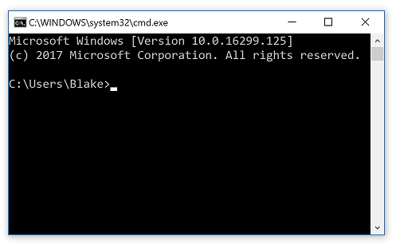
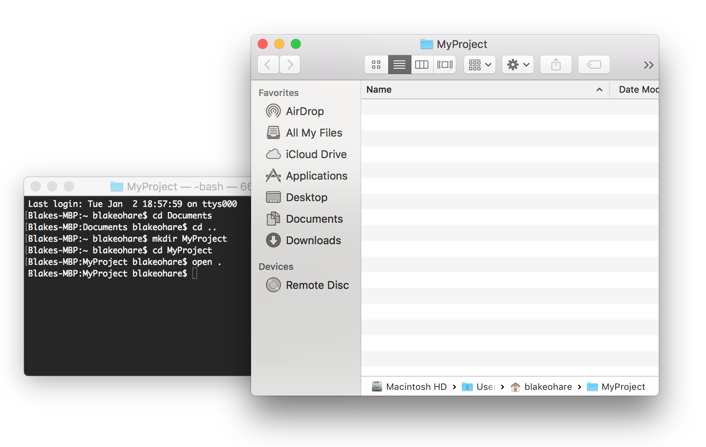

# Using the Command Line

You're probably here because one of the tutorials told you to "go to a such-and-such folder and run a command in the command line". You probably want to get back to that tutorial as quick as possible, so this will be pretty to-the-point.

The command line goes by a few names. In Windows it is often referred to as the **Command Prompt** and in 
OSX and other Unix/Linux-based systems, it's often referred to as the **Terminal** or the **Shell**. 
Either way, they mostly behave the same way and do the same things. 
I've included instructions for both.

## Using the Command Prompt in Windows

There's a couple of ways to start the command prompt. 
But the fastest way is to simply push and hold the Windows key and press R on the keyboard. 
This will bring up the run dialog as seen here:

At the run dialog, type **cmd** and then press enter. A black window will show up that looks like this.

It'll show a directory followed by a prompt where you can type. Typically this is something like `C:\Users\YOUR-USERNAME`. This is called the **Current Working Directory**. 

You can type commands to make Windows do different things in that directory. 
The first command to learn is the **Change Directory** command, which is invoked by typing `cd` followed by a directory name. 
This will change the current working directory to something else. 

For example, there's probably a directory in your user folder called **Documents**. 
You can either type the full path to that directory such as `cd C:\Users\YOUR-NAME\Documents` or you can simply type the name of the directory relative to where you currently are.
Since you're currently in your `C:\Users\YOUR-NAME` folder, you can simply type `cd Documents`.

Now the command line is in the Documents directory. 
To go back, you can use `cd ..` which will go back to the directory above the one you're
currently at, i.e. where you started.

And now you're back.

Another useful command is the **Make Directory** command which can be invoked by typing `mkdir` followed by the folder name you'd like to create.
For example, if you want to create a new project called **MyProject** in your User folder, you can type `mkdir MyProject` while the command prompt is currently in your user folder...

If at any time you'd prefer to use the regular Windows Explorer UI to do certain things, you can always type `explorer .` in any directory and it'll open Windows Explorer in that folder.

Here's a few other useful commands:

* `dir` - Typing `dir` in a directory will list all the files in that directory. 
* `cls` - This will clear the command line screen if you feel like it's getting too cluttered.
* `exit` - This will close the window. But you could also do that by clicking on the close button at the top.
* `notepad` - You can type `notepad` followed by any file name and it will open that file in notepad.

That's pretty much all you need to know when it comes to doing the basics with the command line. 
Any other more specific commands are likely to be explained by the specific tutorial you originally came from. 

## Using the Terminal in OSX/Linux

There's a couple of ways to start the terminal. 
If you haven't used it before, probably the easiest way is to go into finder and click on **Applications** on 
the left side of the window. From there, look for a folder called **Utilities** and you'll see it listed as **Terminal**.
Double click on it. 

A black window will show up that looks like this.

It's probably a good idea to pin the icon since you'll be using this pretty frequently if you continue programming. 

It'll show a directory followed by a prompt where you can type. Typically this is something like `C:\Users\YOUR-USERNAME`. This is called the **Current Working Directory**. 

You can type commands to do different things in that directory. 
The first command to learn is the **Change Directory** command, which is invoked by typing `cd` followed by a directory name. 
This will change the current working directory to something else. 

For example, there's probably a directory in your user folder called **Documents**. 
You can either type the full path to that directory such as `cd /Users/yourname/Documents` or you can simply type the name of the directory relative to where you currently are.
Since you're currently in your `/Users/yourname` folder, you can simply type `cd Documents`.

It's also important to note that the `~` character is often used to denote your user directory.

Now the command line is in the Documents directory. 
To go back, you can use `cd ..` which will go back to the directory above the one you're
currently at, i.e. where you started.

And now you're back.

Another useful command is the **Make Directory** command which can be invoked by typing `mkdir` followed by the folder name you'd like to create.
For example, if you want to create a new project called **MyProject** in your User folder, you can type `mkdir MyProject` while the terminal is currently in your user folder...

If at any time you'd prefer to use the regular Finder UI to do certain things, you can always type `open .` in any directory and it'll open Finder in that folder.

Here's a few other useful commands:

* `ls` - Typing `ls` in a directory will list all the files in that directory. 
* `clear` - This will clear the command line screen if you feel like it's getting too cluttered.
* `Cmd + W` - This will close the window. But you could also do that by clicking on the close button at the top.
* `pico` - You can type `pico` followed by any file name and it will open that file in a simple text editor. Press `Ctrl + X` to close it when you're done and then `y` to save changes.
* `pwd` - This will show the current working directory the terminal is currently in. `pwd` stands for "Print Working Directory".

That's pretty much all you need to know when it comes to doing the basics with the terminal. 
Any other more specific commands are likely to be explained by the specific tutorial you originally came from. 
