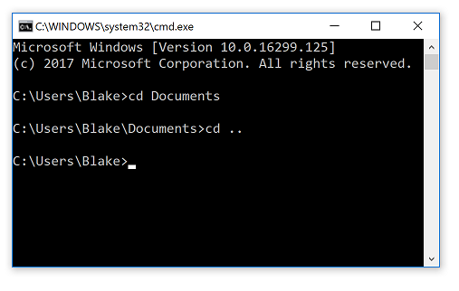
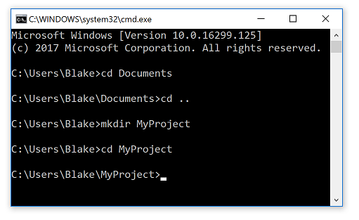

# Using the Command Line

You're probably here because one of the tutorials told you to "go to a such-and-such folder and run a command in the command line". You probably want to get back to that tutorial as quick as possible, so this will be pretty to-the-point.

The command line goes by a few names. In Windows it is often referred to as the "Command Prompt" and in OSX and other Unix/Linux-based systems, it's often referred to as the terminal or the shell. Either way, they mostly behave the same way and do the same things. I've included instructions for both.

## Using the Command Prompt in Windows

There's a couple of ways to start the command prompt. But the fastest way is to simply push and hold the Windows key and press R on the keyboard. This will bring up the run dialog as seen here:

At the run dialog, type **cmd** and then press enter. A black window will show up that looks like this.

It'll show a directory followed by a prompt where you can type. Typically this is something like `C:\Users\YOUR-USERNAME`. This is called the **Current Working Directory**. 

You can type commands to make Windows do different things in that directory. 
The first command to learn is the **Change Directory** command, which is invoked by typing `cd` followed by a directory name. 
This will change the current working directory to something else. 

For example, there's probably a directory in your user folder called **Documents**. 
You can either type the full path to that directory such as `cd C:\Users\YOUR-NAME\Documents` or you can simply type the name of the directory relative to where you currently are.
Since you're currently in your `C:\Users\YOUR-NAME` folder, you can simply type `cd Documents`.

Now the command line is in the Documents directory. 
To go back, you can use `cd ..` which will go back to the directory above the one you're
currently at, i.e. where you started.

## Using the terminal in OSX/Linux

TODO: write this up