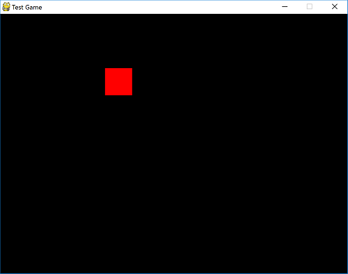
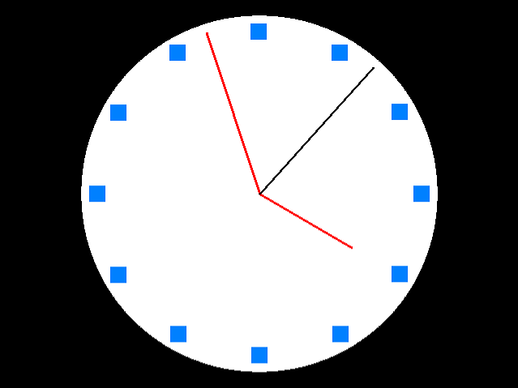
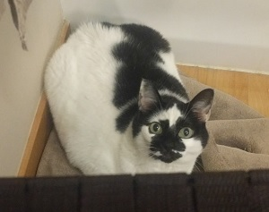
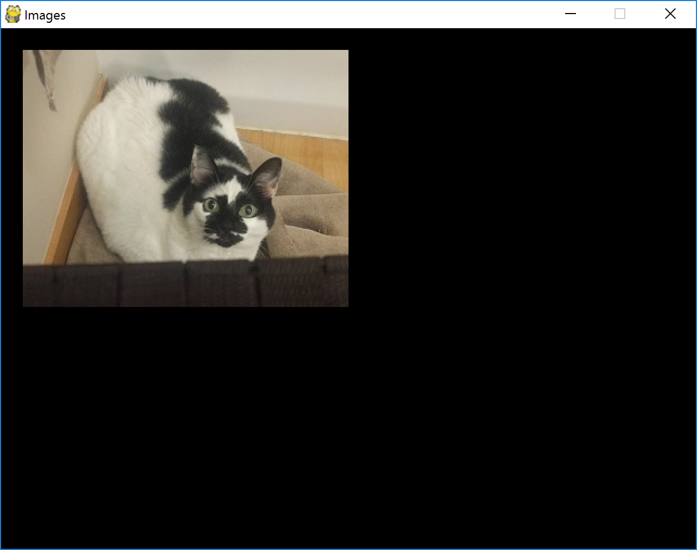
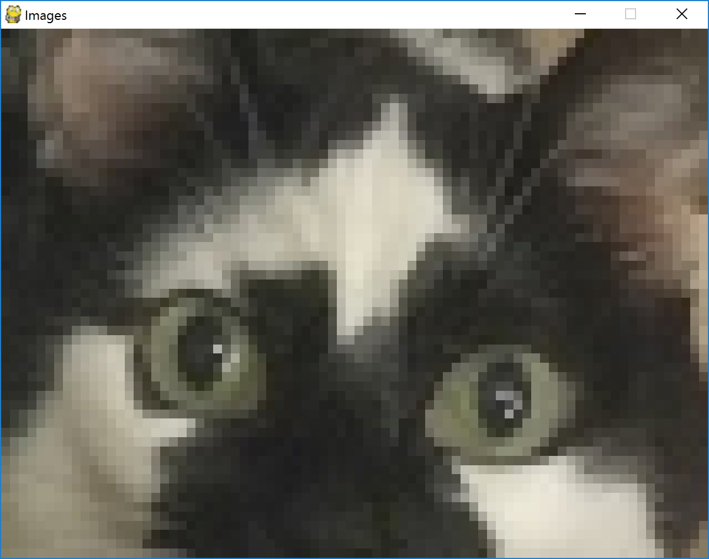

# Introduction to Crayon for Intermediate Programmers

- [Creating a Hello World Project](#creating-a-hello-world-project)
- [Code structure and Execution Starting Point](#code-structure-and-execution-starting-point)
- [Types, Variables, and Math](#types-variables-and-math)
	- [Incremental Assignment](#incremental-assignment)
- [Control Flow](#control-flow)
	- [If Statements](#if-statements)
	- [While Loops](#while-loops)
	- [For Loops](#for-loops)
	- [Do-While Loops](#do-while-loops)
	- [Switch Statements](#switch-statements)
- [Built in Libraries](#built-in-libraries)
- [A Bare Bones "Game"](#a-bare-bones-game)

This tutorial is geared towards programmers who already know at least one or two other programming
languages. It will avoid explaining conceptual fundamentals such as strings, if statements, while
loops, etc. and instead focus on porting your existing knowledge of these language-independent
subjects to Crayon. On the other hand, if the middle of the previous sentence looked like it had
wildly incorrect grammar, you may want to start with the [Beginner's
Tutorial](../intro-beginner.md) instead.

Crayon is an interpreted programming language. You can also export the VM bundled with your compiled byte code to various platforms.

If you have not [downloaded](http://crayonlang.org/download) Crayon and [set up
your environment](http://crayonlang.org/download/installation), please do so now.
	
# Creating a Hello World Project

From the command line, run the following command:

```
C:\Stuff> crayon -genDefaultProj HelloWorld
```

This will create a new directory with a simple HelloWorld project in it. 

Each Crayon project has a build definition file, which is a JSON file.
This file defines the various platforms you want to target and other options that you can
configure for these platforms. It also defines where your source code is and where the output should go.
You can read all about it in the [Project Structure and Build File documentation](../../Docs/project/index.md#build-file)


In the `source` directory, there is a file called `main.cry`. 
The contents looks something like this:

```csharp
function main() {
	print("Hello, World!");
}
```

To run this program, invoke `crayon` from the command line. Pass the .build file path as an argument.
	
```
C:\Stuff\HelloWorld> crayon HelloWorld.build
```

If all is well, "Hello, World!" will appear in the command line:

```
Hello, World!
```

If you see an error message that says `'crayon' is not recognized as an internal or external command,
operable program or batch file.` then your environment is not correctly configured. Revisit the
[installation instructions](http://crayonlang.org/download/installation) or go to the IRC channel
for help.


Congratulations on running your first Crayon program.

# Code structure and Execution Starting Point

Unlike most scripting languages, Crayon requires all code to be wrapped in a function or method
within a class (much like Java/C#). Each program must have a function definition called `main` which
is where execution begins. When the function ends, the program will end. The order of how things are
defined is not important, nor is the name of the files they are in. File layout is also irrelevant,
although it's best to define each class in an individual files that has the same name, for ease of
finding things.

# Types, Variables, and Math

Like most programming languages, there are types and variables. The basic types are the following:

| Type | Description |
| --- | --- |
| **Booleans** | Boolean value, which is either `true` or `false`. |
| **Integers** | Positive or negative whole numbers, or 0. |
| **Floats** | Floating point numbers, i.e. decimals. |
| **Strings** | Strings of text characters. |
| **Null** | The lack of a value. |
| **Lists** | Linear collections of values. |
| **Dictionaries** | Non-ordered collections of values with key lookups. |
| **Object Instance** | An Instance of an object (covered in the OOP tutorial). |

Variables can be used to store values of any type. Assigning a value to a variable is done by
placing a `=` after the variable name followed by the value you want to assign, followed
by a semicolon. Because Crayon is not type safe, the same variable can be reused to store different
types of values.

```csharp
cake = 3.14159; // the cake is a pi
cake = "Y"; // the cake is a Y
cake = null; // the cake is a lie
```
	
Variable names can only contain alphanumeric characters and underscores. However, it cannot
begin with a number.

There are various operators that can be used to manipulate values. These are generally consistent
with most C-style curly-brace languages.

Here is an exhaustive list of all of the operators:

| Operator | Description |
| --- | --- |
| `+` | Addition or concatenation. For numbers, this will add two values. For lists and strings, this concatenates the values and creates a new value. If you add a string to any other type, it will create a string. |
| `-` | Subtraction. This is only valid for numbers. |
| `*` | Multiplication. If a string is multiplied by an integer, it will result in that string duplicated that integer number of times. |
| `/` | Division. Divides two numbers. If the denominator is 0, that results in an error. Integers divided by integers will result in an integer that is rounded down to the nearest integer. |
| `%` | Modulo. Will return remainder of a division operation. Modulo 0 will result in an error. `%` will always return a non-negative number. |
| `&&` | Boolean AND. This will AND two booleans together. This supports short-circuiting. (If the left side is false, the right side will not be evaluated) |
| <code>&#124;&#124;</code> | Boolean OR. This will OR two booleans together. Like AND, this supports short-circuiting i.e. if the left value is true, the right side will not be evaluated. |
| `==` | Equals. Checks to see if two values are the same. For primitive types (such as booleans, numbers, and even strings) this will return true if the values are the same. For reference types, (such as lists, objects, dictionaries) this will return true if and only if the instance is identical. For example, comparing two lists that have identical contents but are separate list instances will result in a false when compared with `==`. |
| `!=` | Not equals. Returns the opposite boolean as `==`. |
| `<` | Less than. Returns true if the value on the left is less than the value on the right. Only works for numbers. |
| `>` | Greater than. Returns true if the value on the left is greater than the value on the right. Only works for numbers. |
| `<=` | Less than or equals. Returns true if the value on the left is less than or equal to the value on the right. Only works for numbers. |
| `>=` | Greater than or equals. Returns true if the value on the left is greater than or equal to the value on the right. Only works for numbers. |
| `&` | Bitwise AND. Performs an AND operation for each bit in the two integers surrounding it. |
| <code>&#124;</code> | Bitwise OR. Performs an OR operation for each bit in the two integers surrounding it. |
| `^` | Bitwise XOR. Performs an XOR operation for each bit in the two integers surrounding it. |
| `<<` | Bit shift left. Only applicable to integers. |
| `>>` | Bit shift right (sign extended). Only applicable to integers. |
| `**` | Exponent. Raises the number on the left to the power on the right. 00 results in 1 because I said so. |
| `!` | Boolean NOT. This is a unary operator that prefixes a value rather than separates two values. |

Like most programming languages, expressions that contain multiple operators are executed in order
of operations. This order is fairly standard ("[Please excuse my dear aunt
sally](http://en.wikipedia.org/wiki/Order_of_operations#Mnemonics)") but an op-by-op description of
the order of operations can be found in the [documentation](../syntax.md). To override this order,
use parenthesis.

Usage:
```csharp
function main() {
  a = 1;
  b = 2;
  c = 4 + a * b; // 6
  d = (4 + a) * b; // 10
  e = 11111 ** 2; // 123454321
  f = -5 % 40; // 35
  g = "W" + 10 * "e" + 4 * "!" + 1; // Weeeeeeeeee!!!!1
}
```

Note that integers and floats are different types. Math operations performed on integers will always
result in integers (except for the exponent operator). Math operations performed on floats will always
result in floats, and operations that mix integers and floats will result in floats. If math operation 
involving integers would conventionally result in a decimal (such as division) the result is rounded
down to force the result to be an integer. This is consistent with most languages, but not all (such 
as JavaScript, which does not make a distinction between integers and floats) and so may be possibly 
unintuitive depending on your previous programming background. Consider the following examples.

```csharp
value = 5 / 2; // this is 2
value = 5.0 / 2.0; // this is 2.5
value = 5 / 2.0; // this is also 2.5
value = 3.8 * 10; // this is the float 38.0, not the integer 38.
```

## Incremental Assignment

If you are reading the value from a variable, modifying it with an operator, and then storing it back into that variable, like this...

```csharp
value = value * 2;
```

...you can shorten this by placing the operator in front of an equals sign after the variable name,
followed by the value you are modifying it by.

```csharp
value *= 2; // does the same as: value = value * 2
```

Furthermore, if you are adding 1 or subtracting 1, you can use the `++` and `--` operators, which
are used as either a prefix or postfix to a variable.

```csharp
value++; // does roughly the same thing as: value = value + 1
```

Unlike other assignment statements, expressions with `++` or `--` can be used inside other
expressions. The caveat is that the when you use the `++` or `--` as a prefix, the value that is
returned is the value that has been modified. If you use it as a suffix, the value that is returned
is the value before it has been modified.

```csharp
function main() {

  a = 100;
  b = ++a;
  print(a); // 101
  print(b); // 101

  c = 100;
  d = c--;
  print(c); // 99
  print(d); // 100
}
```

[comment]: # (WARNBOX)
> Warning: Crayon does not support assignment operations inside other expressions (aside from `++`
> and `--`). For example, `a = b = 0;` is not valid. `b = 0; a = b;` ought to be used instead. This
> design choice was made because, for most programmers, the occurrence of inline assignment is
> usually an accidental typo of `==` and causes more headache than the amount of time/code it saves.

# Control Flow

Crayon supports common control flow constructs that most languages support. These include `if`/`else`
statements, `for` loops, `while` loops, `do`-`while` loops, `switch` statements, and `try`/`catch`/`finally`.

## If Statements

If statements are a way to check a boolean and then execute some code only if that boolean is true.
The syntax is identical to other curly-brace languages.

```csharp
function main() {
  a = 3;
  b = 4;
  if (a * b == 12) {
    print("This program is not very exciting. I apologize.");
  }
}
```

The else condition is also supported...

```csharp
function main() {
  someValue = 4;
  if (someValue > 10) {
    print("It gets better.");
  } else {
    print("I promise.");
  }
}
```

Like other curly-brace languages, the braces are optional if there is only one line of code in the
conditional block.

[comment]: # (WARNBOX)
> The condition of the if statement MUST be a boolean expression. Other types do not get
> canonicalized into booleans. But don't worry if you forget. The compiler will politely remind you
> by exploding.

## While Loops

While loops are also supported. While loops are composed by putting a boolean condition in
parenthesis after the word "while". Then it is followed by a block of code.

```csharp
function main() {
  output = "f";
  while (output.length < 10) {
    output += "o";
  }
  print(output); // fooooooooo
}
```

## For Loops

For loops work the same way as most curly-brace languages:

```csharp
function main() {
  for (i = 10; i >= 1; i--) {
    print(i);
  }
  print("Lift off.");
}
```

For loops are mostly just shorthand for while loops that have a some sort of initialization, a loop 
condition, and an incremental step operation. In the example above, `i` starts at 10, gets decremented
every loop iteration, and continues all the way down to 1. Each of these components are separated by 
semicolons in the parenthesis after the word `for`.

The initialization and the step can also be compounded with multiple statements. In that case, separate
the components with commas instead of semicolons. 
For example, the following code has two initialization statements: `i = 0` and `j = 10`. It also has two
step statements: `i++` and `j--`:

```csharp
function main() {
  for (i = 0, j = 10; i <= 10; i++, j--) {
    print(i * 'X' + j * '.');
  }
}
```

Generates the following output:

```
..........
X.........
XX........
XXX.......
XXXX......
XXXXX.....
XXXXXX....
XXXXXXX...
XXXXXXXX..
XXXXXXXXX.
XXXXXXXXXX
```

All pieces of the for loop are optional and can be omitted...

```csharp
for (;;) {}
```
This has no setup, no step, and the conditional is implicitly always true. It is equivalen to the
following while loop:

```csharp
while (true) {}
```

## Do-While Loops

A water-landing is unlikely, but just in case...

```csharp
i = 0;
do {
  print(++i + " Mississippi");
} while (i < 10);
```

Do-while loops are like while loops except the condition is checked after the code block runs. They
aren't used particularly often.

## Switch Statements

Switch statements are lists of values paired with code to execute if a particular expression matches
that value. They are functionally equivalent to chaining multiple if/else statements together with
the exception that they run instantaneously and only do == comparisons on the values.

The syntax is the word `switch` followed by the expression that you want to evaluate in parenthesis.
After that is a list of `case` keywords followed by the target value of the expression. If the
expression is equal to that target value, it executes the code for that case. The `break` keyword
denotes the end of the case code.

In addition to case statements, there is a `default` keyword that runs if none of the provided case
statements are true. The `default` case is optional.

```csharp
switch (x) {
  case 1:
    print("x is 1");
    break;
  case 2:
    print("One little duck");
    break;
  case 3:
  case 4:
    print("3 or 4. Who knows.");
    break;
  default:
    print("Default code runs for all other values.")
    break;
}
```

Switch statements will switch on either integers or strings, however, they cannot be intermixed. A 
switch statement must have entirely integer cases or entirely string cases.

> WARING: If you are familiar with switch statements in other programming languages, note that
> Crayon does not allow "fall-through" cases i.e. omitting the "break" at the end of the case code
> will be a compile error, rather than allow execution to start running the code of the next case.
> This design choice was made because such fall-through conditions are usually accidental and
> intentional fall-through cases are generally a sign of poorly structured code.

# Built in Libraries

There are several built-in Libraries. These allow you to do more advanced things other than just 
print things to the screen, such as opening a graphics window and drawing images to it, playing 
sounds, interacting with a Gamepad, etc. All built-in libraries either have a platform independent 
implementation or a graceful fallback no-op behavior for platforms where there is no implementation.

`Math` is one of the more commonly used libraries. To import that math library, include 
`import Math;` at the top of the files that you use it. The Math library contains a variety of 
predefined functions.

```csharp
import Math;

function main() {
  print(Math.floor(3.5)); // prints 3
}
```

In the above example, the `import Math;` statement does 2 things. It ensures that the Math function
definitions are bundled into your project. Additionally, it will also indicate that the `Math`
namespace can now be used anywhere in this file. The "Math" that appears within the print statement 
is actually the name of a namespace and .floor indicates that you want to invoke the floor function 
that's in the Math namespace. If you want, you can optionally leave off the namespace like this...

```csharp
import Math;

function main() {
  print(floor(3.5)); // prints 3
}
```

This code is equivalent, but runs the risk that the compiler may get confused in the event that 
another function called floor is defined somewhere else. Math.floor is unambiguous. In fact,
there is also a library called "Core". Core is implicitly imported at the top of all files and the
print statement we've been using so far is actually a function defined in the Core library. And so 
you could potentially also write it like this...

```csharp
import Core;
import Math;

function main() {
  Core.print(Math.floor(3.5)); // prints 3
}
```

The entire list of built in libraries is available in the [documentation](../../Docs/index.md).

# A Simple "Game"

At the core of every game is the game loop. This is generally a while loop that runs indefinitely,
or at least as long as the game is running. In this loop you read input from the user, update the
game model with those inputs, make some calculations to put the game in a new state, and then draw
the new state to the screen. After this is done, it pauses for some amount of time so that each
loop consumes exactly the same amount of time. This amount of time is called the frame rate and
is generally either 60 frames per second or 30 frames per second (where "frame" refers to the
events that take place in the body of the loop).

```csharp
import Game;
import Graphics2D;

function main() {
  title = "Test Game";
  fps = 30;
  windowWidth = 640;
  windowHeight = 480;
  window = new Game.GameWindow(title, fps, windowWidth, windowHeight);

  color = "red";

  while (true) {
    // get the events that have happened since the last frame
    events = window.pumpEvents();
    for (event : events) {
      if (event.type == Game.EventType.QUIT) {
        // remember that when the main() function ends, the program closes.
        return;
      }

      // if the user presses any key...
      if (event.type == Game.EventType.KEY_DOWN) {
        // toggle the box between red and blue
        if (color == "red") {
          color = "blue";
        } else {
          color = "red";
        }
      }
    }

    Graphics2D.Draw.fill(0, 0, 0); // fill the screen with black

    // coordinates for a box
    left = 200;
    top = 100;
    width = 50;
    height = 50;

    // determine color for the box.
    if (color == "red") {
      r = 255;
      g = 0;
      b = 0;
    } else {
      r = 0;
      g = 0;
      b = 255;
    }

    // draw the box
    Graphics2D.Draw.rectangle(left, top, width, height, r, g, b);

    window.clockTick();
  }
}
```

There are quite a few new built-in functions introduced in this snippet.

* **Game.GameWindow** - This is a class that represents that actual window that opens on the user's screen. It has a FPS, width, height, and intercepts events. If you are not familiar with the `new` keyword or Object Oriented programming, it is okay to just nod and move on for the time being.
* **window.pumpEvents()** - This returns a list of all the event objects that have occurred in this window since the last time you called `pumpEvents()`.
* **Game.EventType.QUIT** - This is an enum value that represents an event generated by the user pressing the close button or pressing *Alt + F4*. There are [many others](../../Docs/game.md) that the `.type` field on an event object can be, including `KEY_DOWN` which is also shown, which represents the user pressing a key down.
* **Graphics2D.Draw.fill** - Graphics2D is another library, like Math, Core, and Game, which deals with manipulating graphics on the GameWindow. Graphics2D is dependent on Game. Draw is a class within Graphics2D that contains methods that generally draw primitive geometric objects onto the screen. In this case we're just filling the entire screen each frame with a solid color, black.
* **Graphics2D.Draw.rectangle** - Another Graphics2D.Draw function that draws a rectangle to the screen at the given coordinates, with the given size, and given color. The full list of Draw methods can be found [in the documentation](../../Docs/graphics2d.md).
* **window.clockTick()** - `clockTick()` is a method off of the GameWindow that informs the game window that this frame is now complete and all graphical changes should be flushed to the screen. It also yields control briefly back to the UI thread so that your operating system (or browser) doesn't think the program is stuck in an infinite loop and also to pause just long enough to maintain the frame rate specified at the beginning of the program as an input to GameWindow's constructor.

Compile and run...

```
C:\Stuff\HelloWorld> crayon HelloWorld.build
```

You'll see the following...



The box changes color every time you press a key. Let's change it so that it only changes color when the user presses the space bar and it also moves around when the user presses and holds the arrow keys...

```csharp
import Game;
import Graphics2D;

function main() {
  title = "Test Game";
  fps = 30;
  windowWidth = 640;
  windowHeight = 480;
  window = new Game.GameWindow(title, fps, windowWidth, windowHeight);

  color = "red";

  // This is a dictionary. It will track the state of each arrow key.
  keysPressed = {
    "left": false,
    "right": false,
    "up": false,
    "down": false,
  }
  left = 200;
  top = 100;

  while (true) {
    events = window.pumpEvents();
    for (event : events) {
      if (event.type == Game.EventType.QUIT) {
        return;
      }

      // if the user presses any key...
      if (event.type == Game.EventType.KEY_DOWN || event.type == Game.EventType.KEY_UP) {
        isPress = event.type == Game.EventType.KEY_DOWN;
        switch (event.key) {
          case Game.KeyboardKey.SPACE:
            if (isPress) {
              if (color == "red") {
                color = "blue";
              } else {
                color = "red";
              }
            }
            break;
          case Game.KeyboardKey.LEFT:
            keysPressed["left"] = isPress;
            break;
          case Game.KeyboardKey.RIGHT:
            keysPressed["right"] = isPress;
            break;
          case Game.KeyboardKey.UP:
            keysPressed["up"] = isPress;
            break;
          case Game.KeyboardKey.DOWN:
            keysPressed["down"] = isPress;
            break;
        }
      }
    }

    velocity = 4;
    if (keysPressed["left"]) x -= velocity;
    if (keysPressed["right"]) x += velocity;
    if (keysPressed["up"]) y -= velocity;
    if (keysPressed["down"]) y += velocity;

    Graphics2D.Draw.fill(0, 0, 0); // fill the screen with black

    width = 50;
    height = 50;

    // determine color for the box.
    if (color == "red") {
      r = 255;
      g = 0;
      b = 0;
    } else {
      r = 0;
      g = 0;
      b = 255;
    }

    // draw the box
    Graphics2D.Draw.rectangle(x, y, width, height, r, g, b);

    window.clockTick();
  }
}
```

I'd totally show a screenshot of the new program, but it looks unremarkably different than the previous screenshot.

# Lists and Dictionaries

## Lists

Lists are ordered collections of values. They are denoted with square brackets, [], where the values in the list are delimited by commas.

```csharp
things = ["a", "b", "c"];
```

To extract an item from a list, place brackets after the list with the integer index of the item in the list.

```csharp
things = ["a", "b", "c"];
firstItem = things[0];
lastItem = things[2];
```

The index counts from 0 and must always be an integer type. Floats that happen to be whole numbers are not valid indexes.

To add an item to a list, there is a method called add which will add a new item to the end of the list.

```csharp
things = ["a", "b", "c"];
things.add("d");
```

Here is a list of all the methods and fields that can be called on a list, what they do, and their complexity as a function of the length of the list.

| Operation | Description | Complexity |
| --- | --- | --- |
| **.length** | Returns the length of the list. This is a field, not a method, so parenthesis are not required. | O(1) |
| **.add(item)** | Adds an item to the end of a list. | O(1) amortized |
| **.choice()** | Returns a random item from the list. | O(1) |
| **.clear()** | Removes all elements of the list and changes size to 0. | O(1) |
| **.clone()** | Returns a shallow copy of the list. | O(n) |
| **.concat(secondList)** | Appends all the items in the secondList to the end of this list. | O(n) |
| **.contains(item)** | Returns true if the list contains the given item. Iterates sequentially through the list from the beginning and uses the same logic as == for comparing each item. | O(n) |
| **.filter(function)** | Returns a new copy of the list with some items removed. The function passed in should return true or false and take in one argument, which will be used on each item in the list. Returning true means the item will be preserved in the new copy. | O(n * f(item)) |
| **.insert(index, item)** | Inserts an element into the list such that it will exist at the given index. | O(n) |
| **.join(separator)** | Joins the list together into one string, using the given separator to delimit the items. Uses the same logic to conver the items to a string as when you append the item to a string (e.g. "" + foo) | O(n) |
| **.map(function)** | Returns a new list where the given function has been called on each of the items. The new list is all the return values from the function. | O(n * f(item)) |
| **.pop()** | Removes the last item from the list. Does not return anything. | O(1) |
| **.remove(index)** | Removes the item in the list at the given index. | O(n) |
| **.reverse()** | Reverses the list in place. Does not return a copy. | O(n) |
| **.shuffle()** | Randomizes the order of the list. | O(n) |
| **.sort()** | Sorts the list if it contains only strings or integers. | O(n log n) |
| **.sort(function)** | Sorts the list. The given function should return a sort key that can be used for sorting. Sort keys must be numbers or strings. | O(n log n + n * f(item)) |

## Dictionaries

In the game example, I snuck in an example of a dictionary, in hopes that you'd go along with it by context:

```csharp
keysPressed = {
  "up": false,
  "down": false,
  "left": false,
  "right": false
};
```

Dictionaries are values that allow you to store multiple values in one value. The members of a dictionary (those 4 falses) can be looked up and accessed via some sort of unique key (the 4 strings). A dictionary cannot hold multiple values per key, however a value can be a list.

The keys of a dictionary must be either integers, strings, or object instances but you cannot intermix both. The values of a dictionary can be any type, even mixed in the same dictionary.

The following is perfectly valid:

```csharp
myDictionary = {
  4: false,
  10: "Ponies",
  -3: null,
  928375811: { "Hey, look!": "A nested dictionary!" }
};
```

However, this is not valid:

```csharp
myDictionary = {
  1: true,
  "one": true
};
```

Items in the dictionary are access by their keys, using brackets, much like lists.

```csharp
myDictionary = {
  "a": 1,
  "b": 2,
  "c": 3
};
print(myDictionary["b"]); // 2
print(myDictionary["d"]); // error! D:
```

Adding an item to a dictionary is also done with brackets...

```csharp
myDictionary["x"] = 24;
```

Dictionaries, like lists, also have fields and methods. This table lists all of them:

| Operation | Description | Complexity |
| --- | --- | --- |
| **.length** | Returns the size of the dictionary. This is a field, not a method, so parenthesis are not required. | O(1) |
| **.clear()** | Empties the dictionary and sets the size to 0. | O(1) |
| **.clone()** | Returns a new shallow copy of the dictionary. | O(n) |
| **.contains(key)** | Checks to see if the given key exists in the dictionary. | O(1) |
| **.get(key)** | Returns the value that has the given key if it exists. If it doesn't exists, returns null. | O(1) |
| **.get(key, defaultValue)** | Returns the value that has the given key. If the key does not exist, then return the given default value instead. | O(1) |
| **.keys()** | Returns a list of all the keys in the dictionary. The order that is returned is not deterministic and may vary, especially from platform to platform. | O(n) |
| **.merge(anotherDictionary)** | Takes all the keys from the given dictionary and adds them and their values to the original dictionary. They must have the same key type. This method does not have a return value. | O(n) |
| **.remove(key)** | Removes the item with the given key. If the item does not exist, this generates an error. | O(1) |
| **.values()** | Returns a list of all the values in the dictionary. The order that is returned is also not deterministic. You may not assume that this order corresponds to the same order returned by the keys. | O(n) |

Note that when you use object instances as keys, the pointer value is used as the index like an integer. Similar objects will not create key collisions. They must be the same reference.

# Using the Mouse
 
Now let's modify the rectangle moving "game" to move to where the user clicks the mouse.

Just like how the previous version of our game checked for events of type `KEY_DOWN` and `KEY_UP`, there is also `MOUSE_LEFT_DOWN`, `MOUSE_LEFT_UP`, `MOUSE_RIGHT_DOWN`, `MOUSE_RIGHT_UP`, and `MOUSE_MOVE`. If the event is any type of mouse event, then there are `x` and `y` fields on the event objects, which return the integer coordinates of where the event took place.

In the following example, the x and y coordinates of the most recent `MOUSE_LEFT_DOWN` event are stored as target coordinates, which the rectangle eases towards. It does this by storing the current coordinates in a separate set of variables and then moving those current coordinates closer to the target coordinates using a weighted average of the two.

```csharp
import Game;
import Graphics2D;

function main() {
  title = "Test Game";
  fps = 30;
  windowWidth = 640;
  windowHeight = 480;
  window = new Game.GameWindow(title, fps, windowWidth, windowHeight);

  currentLeft = 200;
  currentTop = 100;
  targetLeft = currentLeft;
  targetTop = currentTop;

  boxWidth = 50;
  boxHeight = 50;

  while (true) {
    events = window.pumpEvents();
    for (event : events) {
      switch (event.type) {
        case Game.EventType.QUIT:
          return;
        case Game.EventType.MOUSE_LEFT_DOWN:
          targetX = event.x - boxWidth / 2;
          targetY = event.y - boxHeight / 2;
          break;
      }
    }

    // remember that integer math will preserve numbers as integers. These won't turn into decimals.
    currentLeft = (9 * currentLeft + targetLeft) / 10;
    currentTop = (9 * currentTop + targetTop) / 10;

    Graphics2D.Draw.fill(0, 0, 0); // fill the screen with black

    // draw the box
    Graphics2D.Draw.rectangle(currentLeft, currentTop, boxWidth, boxHeight, 255, 0, 0);

    window.clockTick();
  }
}
```

Again, I'd love to post a screenshot, but visually, it really looks no different than before.

# More Advanced Drawing

In addition to rectangles, you can also draw ellipses and lines.

```csharp
Graphics2D.Draw.ellipse(left, top, width, height, red, green, blue, alpha);
```

Basically the function for drawing an ellipse is completely identical to drawing a rectangle. It just inscribes an ellipse into the rectangle you lay out.

Drawing a line is slightly differnt...

```csharp
Graphics2D.Draw.line(startX, startY, endX, endY, lineWidth, red, green, blue, alpha);
```

This draws a line from the starting coordinates to the ending coordinates with the given width and color.

The following is a simple demo app that draws a clock face of the current time.

I will use this opportunity to randomly mention that you can define variables outside of functions if the value does not change. These are called constants and use the `const` keyword. It's customary to name constant values in ALL_CAPS with underscores delimiting the words.

```csharp
import Game;
import Graphics2D;
import Math;

const FPS = 30;
const SCREEN_WIDTH = 640;
const SCREEN_HEIGHT = 480;
const CENTER_X = SCREEN_WIDTH / 2;
const CENTER_Y = SCREEN_HEIGHT / 2;
const CLOCK_RADIUS = 220;
const NOTCH_RADIUS = 200;
const MINUTE_HAND_RADIUS = CLOCK_RADIUS - 10;
const HOUR_HAND_RADIUS = CLOCK_RADIUS * 3 / 5;
const SECOND_HAND_RADIUS = MINUTE_HAND_RADIUS;

function main() {
  window = new GameWindow("Current Time", FPS, SCREEN_WIDTH, SCREEN_HEIGHT);

  while (true) {
    for (event : window.pumpEvents()) {
		if (event.type == EventType.QUIT) {
			return;
		}
    }

    epochTime = Math.floor(Core.currentTime());
    clockTime = epochTime % (60 * 60 * 12); // mod the time by 12 hours

    second = clockTime % 60;
    totalMinutes = clockTime / 60;
    minute = totalMinutes % 60;
    hour = totalMinutes / 60; 

    // Draw the clock face.
    Graphics2D.Draw.ellipse(
      CENTER_X - CLOCK_RADIUS,
      CENTER_Y - CLOCK_RADIUS,
      CLOCK_RADIUS * 2,
      CLOCK_RADIUS * 2,
      255, 255, 255); // white

    // Draw 12 notches
    for (i = 0; i < 12; ++i) {
      // Warning: trigonometry ahead

      // Just like above in our code, libraries sometimes have their own const values. Like Math.PI.
      angle = i * 2 * Math.PI / 12;
      x = Math.floor(Math.cos(angle) * NOTCH_RADIUS) + CENTER_X;
      y = Math.floor(Math.sin(angle) * NOTCH_RADIUS) + CENTER_Y;
      Graphics2D.Draw.rectangle(
        x - 10, y - 10, 20, 20, 
        0, 128, 255); // a nice shade of blue
    }

    hourAngle = 2 * Math.PI * hour / 12.0;
    minuteAngle = 2 * Math.PI * minute / 60.0;
    secondAngle = 2 * Math.PI * second / 60.0;

    // the clock hands are oriented such that they point up at "time 0" so
    // the sin and cos are swapped from what you're typically used to.
    hourX = CENTER_X + Math.floor(Math.sin(hourAngle) * HOUR_HAND_RADIUS);
    hourY = CENTER_Y - Math.floor(Math.cos(hourAngle) * HOUR_HAND_RADIUS);
    minuteX = CENTER_X + Math.floor(Math.sin(minuteAngle) * MINUTE_HAND_RADIUS);
    minuteY = CENTER_Y - Math.floor(Math.cos(minuteAngle) * MINUTE_HAND_RADIUS);
    secondX = CENTER_X + Math.floor(Math.sin(secondAngle) * SECOND_HAND_RADIUS);
    secondY = CENTER_Y - Math.floor(Math.cos(secondAngle) * SECOND_HAND_RADIUS);

    Graphics2D.Draw.line(hourX, hourY, CENTER_X, CENTER_Y, 3, 255, 0, 0, 255);
    Graphics2D.Draw.line(minuteX, minuteY, CENTER_X, CENTER_Y, 3, 255, 0, 0, 255);
    Graphics2D.Draw.line(secondX, secondY, CENTER_X, CENTER_Y, 3, 0, 0, 0, 255);

    // name unrelated to the fact that we're rendering a ticking clock...
    window.clockTick();
  }
}
```

The result of which will look something like this...



# Images

For most normal 2D games, you'll mostly be using images rather than raw geometry.

To include an image in the program's resources, place it somewhere within the directory as your code. The path relative to the root of the build file's `<source>` is the path that will be used to load it. For example, if you put a file called `foo.png` inside a directory called `images`, which is in the folder pointed at by `<source>` in the build file, then you would load it as `images/foo.png`.

To load the image, do the following...

```csharp
import ImageResources;

...

rawImageResource = ImageLoader.loadFromResources("images/foo.png");
```

`rawImageResource` is now exactly that, a rawImageResource that represents a bitmap. With the resource, you can do various things with it using libraries such as edit the pixels, upload the image somewhere, but in our case, we're interested in getting it to appear on the screen. In order to do this, the image needs to be loaded into the graphics engine...

```csharp
import Graphics2D;
import ImageResources;

...

rawImage = ImageLoader.loadFromResource("images/foo.png");
usableImage = GraphicsTexture.load(rawImage);

...

usableImage.draw(0, 0);
```

`GraphicsTexture.load` returns an instance of a GraphicsTexture object from an ImageResource object that can be used to display the image on the screen. The coordinates indicate where you want the top left portion of the image to appear.

Here's an end-to-end example. The following image is `images/bad_kitty.jpg` which exists in the `<source>` directory.



```csharp
import Game;
import Graphics2D;
import ImageResources;

function main() {
  title = "Images";
  fps = 30;
  windowWidth = 640;
  windowHeight = 480;
  window = new Game.GameWindow(title, fps, windowWidth, windowHeight);
  
  rawImage = ImageLoader.loadFromResources('images/bad_kitty.jpg');
  image = GraphicsTexture.load(rawImage);

  while (true) {

    events = window.pumpEvents();
    for (event : events) {
      if (event.type == Game.EventType.QUIT) {
        return;
      }

    }

    Graphics2D.Draw.fill(0, 0, 0);

    // Display bad_kitty.jpg in the top left corner with a 20 pixel margin
    image.draw(20, 20); 

    window.clockTick();
  }
}
```

Here is the result:



There are actually quite a handful of drawing methods on the image object that let you do more interesting things than strictly copying it, such as drawing it at different opacities, sizes, angles, or only drawing certain portions of the image, which can all be found in the documentation for Graphics2D.GraphicsTexture.

For example, you can make the image appear cropped and stretched...

```csharp
image.drawRegionStretched(
	0, 0, // screen top-left
	windowWidth, windowHeight, // size on screen
	151, 108, // original image crop top-left
	80, 57); // original image crop size
```



## Asynchronous Image Loading

You can load images asynchronously. Instead of invoking `ImageLoader.loadFromResources(path)` call `ImageLoader.loadFromResourcesAsync(path)`. This will return an `ImageLoader` instance instead of an ImageResource. An ImageLoader has `.isDone()` and `.getImage()` methods. `.isDone()` returns a boolean and once it starts returning true, you can call `.getImage()` which returns the image resource.

## Image Sheets

Loading individual images is tedious, both from a code perspective and a CPU perspective. If you lots of tiny images and export to JavaScript, that will equate to millions of tiny HTTP requests. With a slight delay for each, your program will load really slowly and likely just get shut down by the browser as an unresponsive page. If those thousands of tiny images (imagine a retro style adventure game with lots of 16x16 tiles) were all stored in one massive image, that image would take a second or two to load. Which is really good, not only for minimizing HTTP chattiness, but also loading from a slow hard drive.

The notion of ImageSheets are built into the ImageResources library and build file. 

An image sheet is a logical collection of images defined by a series of file prefixes. At compile time, these image resources will be combined into large sheets of images. ImageResources will load these as single images, but still return individual ImageResource instances that behave exactly like their original non-aggregated counterpart.

Here's an example of a series of ImageSheet definitions:

```xml
<build>
  
  ...
  
  <!-- Image sheets -->
  <imagesheets>
    <sheet id="sprites">
      <prefix>images/player/</prefix>
      <prefix>images/enemies/</prefix>
      <prefix>images/items/</prefix>
    </sheet>
    <sheet id="tiles">
      <prefix>images/tiles/</prefix>
    </sheet>
    <sheet id="everything_else">
      <prefix>*</prefix>
    </sheet>
  </imagesheets>
  
  ...

</build>
```

In order to load these, you must use `ImageSheet` instead of `ImageLoader`. Like ImageLoader, image sheets can be loaded either synchronously or asynchronously.

```csharp
imageSheet = ImageSheet.loadFromResources(sheetId);

...

imageSheet = ImageSheet.loadFromResourcesAsync(sheetId);
```

For asynchronous loading image sheets, there are two methods to check the current status: 
* `imageSheet.isDone()` returns a boolean if it is done.
* `imageSheet.getProgress()` returns a float ratio between 0.0 and 1.0.

After loading is complete, images can be accessed using `imageSheet.getImage(path)` which will synchronously return an ImageResource instance.


