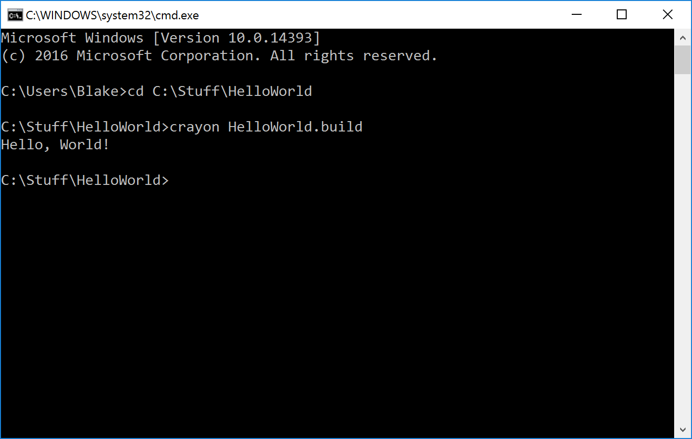

# Introduction to Crayon for Intermediate Programmers

This tutorial is geared towards programmers who already know at least one or two other programming
languages. It will avoid explaining conceptual fundamentals such as strings, if statements, while
loops, etc. and instead focus on porting your existing knowledge of these language-independent
subjects to Crayon. On the other hand, if the middle of the previous sentence looked like it had
wildly incorrect grammar, you may want to start with the [Beginner's
Tutorial](../intro-beginner.md) instead.

Crayon is a programming language that targets multiple platforms. The output of the compiler is the 
source code of the virtual machine coupled with the compiled byte code of your program.

If you have not [downloaded](http://crayonlang.org/download) Crayon and [set up
your environment](http://crayonlang.org/download/installation), please do so now.
	
## Creating a Hello World Project
	
Create a new directory caled HelloWorld for your project somewhere. Create two subdirectories called
'source' and 'output' in here.

At the core of each Crayon project is a build definition file, which is composed of relatively simple
XML. This file defines the various platforms you want to target and other options that you can
configure for these platforms.

There is a wonderful universe of options and configurations that I could ramble about for a long
time. But for the sake of actually getting something working, copy and paste this mostly
one-size-fits-all build definition into your HelloWorld.build file:
	
```xml
<build>
  <projectname>HelloWorld</projectname>
  <source>source/</source>
  <output>output/%TARGET_NAME%</output>

  <!-- Targets -->
  <target name="javascript">
	<platform>game-javascript</platform>
  </target>

  <target name="java">
	<platform>game-java-awt</platform>
  </target>

  <target name="python">
	<platform>game-python-pygame</platform>
  </target>

  <target name="csharp">
	<platform>game-csharp-opentk</platform>
  </target>
</build>
```

When you compile, you will invoke crayon.exe from the command line and pass it a path to a .build
file and a `-target` flag followed by one of the target names. Like this:
	
```
C:\Stuff\HelloWorld> crayon HelloWorld.build -target python
```

The source code is compiled from the files in the directory defined by the value of the `<source>`
element and the output goes into the directory defined by the vaule of the `<output>` element. The
four platforms available are listed in the build definition above.

But of course in order for this to work, you will first need some actual source code.

In the source folder, create a file called main.cry (the name of the file isn't terribly important,
as long as it ends in a .cry file extension) and paste the following code:
	
```crayon
function main() {
	print("Hello, World!");
}
```

Run the compilation command for the platform you wish to use. Note that the output of Crayon is
actually the source code of a program in the platform you choose, not an executable that is
necessarily ready to run, so in order to run it you may need some pre-requisite libraries or
frameworks. Use the chart below to figure out which platform is most convenient for you to run.

| ID | Name |  |
| --- | --- | --- |
| game-csharp-opentk | C# and OpenGL (using OpenTK) | Use this if you have a C# build environemnt set up, preferably Visual Studio. The output that Crayon generates provides the necessary OpenTK and Tao DLL files, so if you can compile C#, you should be good to go. |
| game-java-awt | Java using AWT | These creates a vanilla client-side Java project that uses AWT so it will run in desktop environments but lacks some support for certain features such as sound and gamepad. This will not run in Android. This includes an Ant build file. |
| game-python-pygame | Python using PyGame | Exports your project as a PyGame program. It will run in Python 2.5+ or Python 3, as long as you have PyGame installed. This is however one of the slower platforms as the lack of a switch statement makes the VM hard to translate. |
| game-javascript | JavaScript | Creates a basic JavaScript project that runs using HTML5 Canvas. Should run locally without a server as long as your project doesn't require files such as images or sounds. If you do wish to upload your project to a server, provide an additional jsfileprefix element in the build file to indicate the file prefix of where it is uploaded to. This is demonstrated in the js_remote target in the above build file sample. |

I will be using Python in this tutorial but you can follow along in any platform.

Run the compilation command:

```
C:\Stuff\HelloWorld> crayon HelloWorld.build -target python
```

If you see an error message that says "'crayon' is not recognized as an internal or external command,
operable program or batch file." then your environment is not correctly configured. Revisit the
[installation instructions](http://crayonlang.org/download/installation) or go to the IRC channel
for help.
	
If it worked, you'll notice there is now a folder called "output" which contains a folder called
"python". In this folder there is an game.py which will display the following message when run:



Congratulations on running your first Crayon program.

# Code structure and Execution Starting Point

Unlike most scripting languages, Crayon requires all code to be wrapped in a function or method
within a class. Each program must have a function definition called `main` which is where execution
begins. When the function ends, the program will end. The order of how things are defined is not
important, nor is the name of the files they are in. File layout is also irrelevant as all code
is more or less combined together into one big mushy ball at the beginning of the compilation phase,
much like C# code within the same assembly.

# Types, Variables, and Math
	
Like most programming languages, there are types and variables. The basic types are the following:

| Type | Description |
| --- | --- |
| **Booleans** | Boolean value, which is either `true` or `false`. |
| **Integers** | Positive or negative whole numbers. |
| **Floats** | Floating point numbers, i.e. decimals. |
| **Strings** | Strings of text characters. |
| **Null** | The lack of a value. |
| **Lists** | Linear collections of values. |
| **Dictionaries** | Non-ordered collections of values with key lookups. |
| **Object Instance** | An Instance of an object (covered in the OOP tutorial). |

Variables can be used to store values of any type. Assigning a value to a variable is done by
placing an equals sign after the variable name followed by the value you want to assign, followed
by a semicolon. Because Crayon is not type safe, the same variable can be reused to store different
kinds of types.

```crayon
cake = 3.14159; // the cake is a pi
cake = "Y"; // the cake is a Y
cake = null; // the cake is a lie
```
	
Variable names can only contain alphanumeric characters and underscores. However, it cannot
begin with a number.

There are various operators that can be used to manipulate values. These are generally consistent
with most C-style languages.

Here is an exhaustive list of all of the operators:

| Operator | Description |
| --- | --- |
| `+` | Addition or concatenation. For lists and strings, this concatenates values. For numbers, it is simple addition. If you add a string to any other type of value, it will result in a string. |
| `-` | Subtraction. This is only valid for numbers. |
| `*` | Multiplication. If a string is multiplied by an integer, it will result in that string duplicated that integer number of times. |
| `/` | Division. Divides two numbers. If the denominator is 0, that results in an error. Integers divided by integers will result in an integer that is rounded down to the nearest integer. |
| `%` | Modulo. Will return remainder of a division operation. Modulo 0 will result in an error. Unlike some languages, `%` will always return a positive number. |
| `&&` | Boolean AND. This will AND two booleans together. This supports short-circuiting. (If the left side is false, the right side will not be evaluated) |
| `||` | Boolean OR. This will OR two booleans together. Like AND, this supports short-circuiting if the left value is true. |
| `==` | Equals. Checks to see if two values are the same. For primitive types (such as booleans, numbers, and even strings) this will return true if the values are the same. For reference types, (such as lists, objects, dictionaries) this will return true if and only if the instance is identical. For example, comparing two lists that have identical contents but are separate list instances will result in a false when compared with `==`. |
| `!=` | Not equals. Returns the opposite of `==`. |
| `<` | Less than. Returns true if the value on the left is less than the value on the right. Only works for numbers. |
| `>` | Greater than. Returns true if the value on the left is greater than the value on the right. Only works for numbers. |
| `<=` | Less than or equals. You get the picture by now. |
| `>=` | Greater than or equals. |
| `&` | Bitwise AND. Performs an AND operation for each bit in the two numbers surrounding it. |
| `|` | Bitwise OR. |
| `^` | Bitwise XOR. |
| `<<` | Bit shift left. |
| `>>` | Bit shift right (sign extended). |
| `**` | Exponent. Raises the number on the left to the power on the right. 00 results in 1 because I said so. |
| `!` | Boolean NOT. This is a unary operator that prefixes a value rather than separates two values. |

Like most programming languages, expressions that contain multiple operators are executed in order
of operations. This order is fairly standard ("[Please excuse my dear aunt
sally](http://en.wikipedia.org/wiki/Order_of_operations#Mnemonics)") but an op-by-op description of
the order of operations can be found in the [documentation](../syntax.md). To override this order,
use parenthesis.

Usage:
```crayon
function main() {
  a = 1;
  b = 2;
  c = 4 + a * b; // 6
  d = (4 + a) * b; // 10
  e = 11111 ** 2; // 123454321
  f = -5 % 40; // 35
  g = "W" + 10 * "e" + 4 * "!" + 1; // Weeeeeeeeee!!!!1
}
```

## Incremental Assignment

If you are reading the value from a variable, modifying it with an operator, and then storing it back into that variable, like this...

```crayon
value = value * 2;
```

...you can shorten this by placing the operator in front of an equals sign after the variable name,
followed by the value you are modifying it by.

```crayon
value *= 2; // does the same as: value = value * 2
```

Furthermore, if you are adding 1 or subtracting 1, you can use the `++` and `--` operators, which
are used as either a prefix or postfix to a variable.

```crayon
value++; // does roughly the same thing as: value = value + 1
```

Unlike other assignment statements, expressions with `++` or `--` can be used inside other
expressions. The caveat is that the when you use the `++` or `--` as a prefix, the value that is
returned is the value that has been modified. If you use it as a suffix, the value that is returned
is the value before it has been modified.

```crayon
function main() {

  a = 100;
  b = ++a;
  print(a); // 101
  print(b); // 101

  c = 100;
  d = c--;
  print(c); // 99
  print(d); // 100
}
```

[comment]: # (WARNBOX)
> Warning: Crayon does not support assignment operations inside other expressions (aside from `++`
> and `--`). For example, `a = b = 0;` is not valid. `b = 0; a = b;` ought to be used instead. This
> design choice was made because, for most programmers, the occurrence of inline assignment is
> usually an accidental typo of `==` and causes more headache than the amount of time/code it saves.

# Control Flow

Crayon supports common control flow constructs that most languages support. These include if/else
statements, for loops, while loops, do-while loops, and switch statements.

## If Statements

If statements are a way to check a boolean and then execute some code only if that boolean is true.
The syntax is identical to other curly-brace languages.

```crayon
function main() {
  a = 3;
  b = 4;
  if (a * b == 12) {
    print("This program is not exciting. I apologize.");
  }
}
```

The else condition is also supported...

```crayon
function main() {
  if (someValue > 10) {
    print("It gets better.");
  } else {
    print("I promise.");
  }
}
```

Like other curly-brace languages, the braces are optional if there is only one line of code in the
conditional block.

[comment]: # (WARNBOX)
> The condition of the if statement MUST be a boolean expression. Other types do not get
> canonicalized into booleans. But don't worry if you forget. The compiler will politely remind you
> by exploding.

## While Loops

While loops are also supported. While loops are composed by putting a boolean condition in
parenthesis after the word "while". Then it is followed by a block of code.

```crayon
function main() {
  output = "f";
  while (output.length < 10) {
    output += "o";
  }
  print(output);
}
```

## For Loops

For loops are really just shorthand for while loops that have a setup, condition, and step
operation. For loops are constructed with the word `for` followed by parenthesis enclosing 3
semicolon-delimited parts. The first part is a list of statements separated by commas that indicate 
some sort of setup. The second part is a boolean expression. The third and final part is a list of 
statements separated by commas that indicate some sort of stepping command. After the parenthesis is
a block of code.

```crayon
function main() {
  for (output = "f"; output.length < 10; output += "o") {
    print(output);
  }
}
```

The initialization (first part) is run first. Then condition is checked before running the body of
the code. Then the nested code block runs. After the code block is done, the stepping command is 
run. Then it loops back and checks the condition again before trying to run it again. And then it
keeps repeating until the condition is no longer true.

You'll notice this code snippet is roughly equivalent to the while loop code above (aside from the
print statement). 
Here's an example of a for loop that uses compound initialization and stepping...

```crayon
function main() {
  for (i = 0, j = 10; i <= 10; i++, j--) {
    print(i * 'X' + j * '.');
  }
}
```

Generates the following output:

```
..........
X.........
XX........
XXX.......
XXXX......
XXXXX.....
XXXXXX....
XXXXXXX...
XXXXXXXX..
XXXXXXXXX.
XXXXXXXXXX
```

All pieces of the for loop are optional and can be omitted...

```crayon
for (;;) {}
```
This has no setup, no step, and the conditional is implicitly always true. It is equivalen to the
following while loop:

```crayon
while (true) {}
```

## Do-While Loops

Although a water landing is unlikely, just in case...

```crayon
i = 0;
do {
  print(++i + " Mississippi");
} while (i < 10);
```

Do-while loops are like while loops except the condition is checked after the code block runs. They
aren't used particularly often.

## Switch Statements

Switch statements are lists of values paired with code to execute if a particular expression matches
that value. They are functionally equivalent to chaining multiple if/else statements together with
the exception that they run instantaneously and only do == comparisons on the values.

The syntax is the word `switch` followed by the expression that you want to evaluate in parenthesis.
After that is a list of `case` keywords followed by the target value of the expression. If the
expression is equal to that target value, it executes the code for that case. The `break` keyword
denotes the end of the case code.

In addition to case statements, there is a `default` keyword that runs if none of the provided case
statements are true. The `default` case is optional.

```crayon
switch (x) {
  case 1:
    print("x is 1");
    break;
  case 2:
    print("One little duck");
    break;
  case 3:
  case 4:
    print("3 or 4. Who knows.");
    break;
  default:
    print("Default code runs for all other values.")
    break;
}
```

Switch statements will switch on either integers or strings, however, they cannot be intermixed. A 
switch statement must have entirely integer cases or entirely string cases.

> WARING: If you are familiar with switch statements in other programming languages, note that
> Crayon does not allow "fall-through" cases i.e. omitting the "break" at the end of the case code
> will be a compile error, rather than allow execution to start running the code of the next case.
> This design choice was made because such fall-through conditions are usually accidental and
> intentional fall-through cases are generally a sign of poorly structured code.

# Built in Libraries

There are several built-in Libraries. These allow you to do more advanced things other than just 
print things to the screen, such as opening a graphics window and drawing images to it, playing 
sounds, accessing Gamepad, etc. All built-in libraries either have a platform independent 
implementation or a graceful fallback no-op behavior for platforms where there is no implementation.

`Math` is one of the more commonly used libraries. To import that math library, include 
`import Math;` at the top of the files that you use it. The Math library contains a variety of 
predefined functions.

```crayon
import Math;

function main() {
  print(Math.floor(3.5)); // prints 3
}
```

In the above example, the `import Math;` statement does 2 things. It bundles the function
definitions in the Math library into your project if it already hasn't been already from another
file that may also include a Math import. Additionally, it will also indicate that the `Math`
namespace can now be used anywhere in this file. The "Math" that appears within the print statement 
is actually the name of a namespace and .floor indicates that you want to invoke the floor function 
that's in the Math namespace. Because Math is imported, you can optionally leave off the namespace 
like this...

```crayon
import Math;

function main() {
  print(floor(3.5)); // prints 3
}
```

This code is equivalent, but runs the risk that the compiler may get confused in the event that 
another function called floor is defined somewhere else. Math.floor is unambiguous. Either 
Math.floor or just floor may be considered "cleaner" depending on your school of thought. In fact,
there is also a library called "Core". Core is implicitly imported at the top of all files and the
print statement we've been using so far is actually a function defined in the Core library. And so 
you could potentially also write it like this...

```crayon
import Core;
import Math;

function main() {
  Core.print(Math.floor(3.5)); // prints 3
}
```

The entire list of built in libraries is available in the [documentation](../../Docs/index.md).

# A Bare Bones "Game"

At the core of every game is the game loop. This is generally a while loop that runs indefinitely, or at least as long as the game is running. In this loop you read input from the user, update the game model with those inputs, make some calculations to put the game in a new state, and then draw the new state to the screen. After this is done, it pauses for some amount of time so that each loop consumes exactly the same amount of time. This amount of time is called the frame rate and is generally either 60 frames per second or 30 frames per second (where "frame" refers to the events that take place in the body of the loop).

```crayon
import Game;
import Graphics2D;

function main() {
  title = "Test Game";
  fps = 30;
  windowWidth = 640;
  windowHeight = 480;
  window = new Game.GameWindow(title, fps, windowWidth, windowHeight);

  color = "red";

  while (true) {
    // get the events that have happened since the last frame
    events = window.pumpEvents();
    for (event : events) {
      if (event.type == Game.EventType.QUIT) {
        // remember that when the main() function ends, the program closes.
        return;
      }

      // if the user presses any key...
      if (event.type == Game.EventType.KEY_DOWN) {
        // toggle the box between red and blue
        if (color == "red") {
          color = "blue";
        } else {
          color = "red";
        }
      }
    }

    Graphics2D.Draw.fill(0, 0, 0); // fill the screen with black

    // coordinates for a box
    left = 200;
    top = 100;
    width = 50;
    height = 50;

    // determine color for the box.
    if (color == "red") {
      r = 255;
      g = 0;
      b = 0;
    } else {
      r = 0;
      g = 0;
      b = 255;
    }

    // draw the box
    Graphics2D.Draw.rectangle(left, top, width, height, r, g, b);

    window.clockTick();
  }
}
```

There are quite a few new built-in functions introduced in this snippet.

* **Game.GameWindow** - This is a class that represents that actual window that opens on the user's screen. It has a FPS, width, height, and intercepts events. If you are not familiar with the `new` keyword or Object Oriented programming, it is okay to just nod and move on for the time being.
* **window.pumpEvents()** - This returns a list of all the event objects that have occurred in this window since the last time you called `pumpEvents()`.
* **Game.EventType.QUIT** - This is an enum value that represents an event generated by the user pressing the close button or pressing *Alt + F4*. There are [many others](../../Docs/game.md) that the `.type` field on an event object can be, including `KEY_DOWN` which is also shown, which represents the user pressing a key down.
* **Graphics2D.Draw.fill** - Graphics2D is another library, like Math, Core, and Game, which deals with manipulating graphics on the GameWindow. Graphics2D is dependent on Game. Draw is a class within Graphics2D that contains methods that generally draw primitive geometric objects onto the screen. In this case we're just filling the entire screen each frame with a solid color, black.
* **Graphics2D.Draw.rectangle** - Another Graphics2D.Draw function that draws a rectangle to the screen at the given coordinates, with the given size, and given color. The full list of Draw methods can be found [in the documentation](../../Docs/graphics2d.md).
* **window.clockTick()** - `clockTick()` is a method off of the GameWindow that informs the game window that this frame is now complete and all graphical changes should be flushed to the screen. It also yields control briefly back to the UI thread so that your operating system (or browser) doesn't think the program is stuck in an infinite loop and also to pause just long enough to maintain the frame rate specified at the beginning of the program as an input to GameWindow's constructor.

Compile...

```
C:\Stuff\HelloWorld> crayon HelloWorld.build -target python
```

Run it and you'll see the following...

